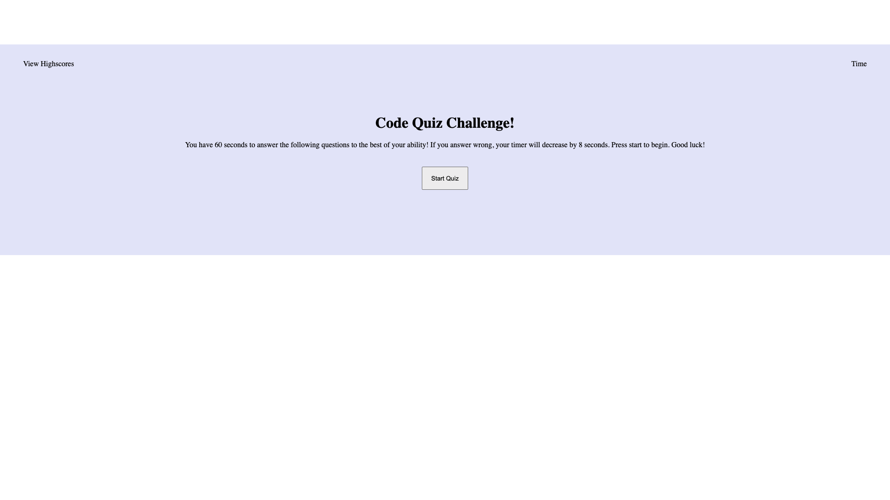

# code-quiz

I was motivated to make a web application where a user could take a code quiz. I wanted to be able to apply what I have learned and implement it into a successful and functional web application.

When successfully excecuted, this application tests your knowledge of basic coding facts.

I learned that there is still much more to learn. I know that my javascript file is quite repetitive and there are much shorter ways to implement the code I do have.

Below is what my starting page looks like for the code quiz.

